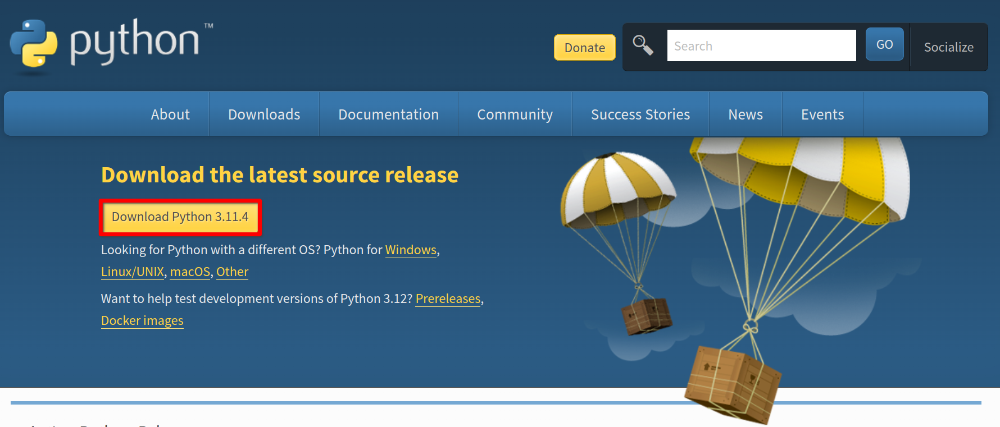

# Tetris - Тетрис

## Installation & Setup

To run this program please make sure you have [python](https://www.python.org/downloads/) installed on your system.

<figure><figcaption></figcaption></figure>

Download the ZIP folder from the GitHub repository.

<figure><figcaption></figcaption></figure>

As shown in the following video:

* Extract the contents of the zip folder into another folder
* Open the extracted folder, open main.py and run the module.

https://github.com/LunaTMT/Tetris/assets/44672093/c659de2d-9401-4bb3-b3e2-3dcf0d28ff9c

